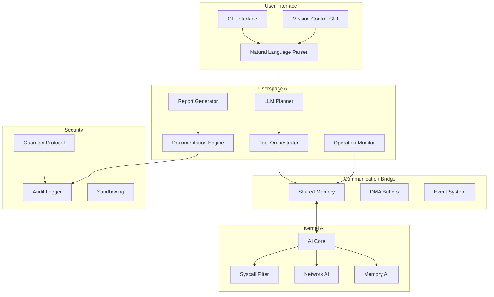

# Design Document

## Overview

Archangel Linux is designed as a hybrid kernel-userspace AI security operating system that provides autonomous cybersecurity operations through natural language commands. The system architecture balances microsecond-level decision making in kernel space with complex AI reasoning in userspace, creating a comprehensive autonomous security platform.

The design follows a layered approach where kernel AI modules handle real-time security decisions (syscall filtering, packet classification, memory pattern analysis) while userspace components manage complex operations like LLM-based planning, tool orchestration, and comprehensive reporting.

## Architecture

### Hybrid AI Architecture Layers

```
┌─────────────────────────────────────────────────────────────┐
│                    User Interface Layer                      │
│  ┌─────────────┐  ┌──────────────┐  ┌─────────────────┐   │
│  │ Natural     │  │ Mission      │  │ REST API        │   │
│  │ Language    │  │ Control GUI  │  │ Interface       │   │
│  │ Shell       │  │              │  │                 │   │
│  └─────────────┘  └──────────────┘  └─────────────────┘   │
├─────────────────────────────────────────────────────────────┤
│                Userspace AI Orchestration                    │
│  ┌─────────────┐  ┌──────────────┐  ┌─────────────────┐   │
│  │ LLM Planning│  │ Complex      │  │ Learning        │   │
│  │ Engine      │  │ Analysis     │  │ Module          │   │
│  └─────────────┘  └──────────────┘  └─────────────────┘   │
├─────────────────────────────────────────────────────────────┤
│              Kernel-Userspace Bridge                         │
│  ┌─────────────────────────────────────────────────────┐   │
│  │ Shared Memory Ring Buffers | Zero-Copy DMA         │   │
│  │ Event Notification System  | Synchronization       │   │
│  └─────────────────────────────────────────────────────┘   │
├─────────────────────────────────────────────────────────────┤
│                 Kernel AI Modules                            │
│  ┌─────────────┐  ┌──────────────┐  ┌─────────────────┐   │
│  │ Syscall     │  │ Network      │  │ Memory          │   │
│  │ Filter AI   │  │ Packet AI    │  │ Pattern AI      │   │
│  └─────────────┘  └──────────────┘  └─────────────────┘   │
├─────────────────────────────────────────────────────────────┤
│                    Security Framework                        │
│  ┌─────────────┐  ┌──────────────┐  ┌─────────────────┐   │
│  │ Guardian    │  │ Audit        │  │ Sandboxing      │   │
│  │ Protocol    │  │ Logger       │  │ Engine          │   │
│  └─────────────┘  └──────────────┘  └─────────────────┘   │
├─────────────────────────────────────────────────────────────┤
│                Modified Linux Kernel (5.15+)                 │
│  ┌─────────────┐  ┌──────────────┐  ┌─────────────────┐   │
│  │ AI-Enhanced │  │ Security     │  │ Performance     │   │
│  │ Syscalls    │  │ Hooks        │  │ Optimizations   │   │
│  └─────────────┘  └──────────────┘  └─────────────────┘   │
└─────────────────────────────────────────────────────────────┘
```

### Component Interaction Flow



## Components and Interfaces

### Kernel AI Components

#### AI Core Module (`archangel_core`)
- **Purpose**: Central coordination of kernel AI operations
- **Interface**: Provides unified API for userspace communication
- **Performance**: <1ms inference time, <10MB memory usage, <5% CPU
- **Structure**:
```c
struct archangel_kernel_ai {
    /* Lightweight AI engines */
    struct {
        struct decision_tree *syscall_filter;
        struct pattern_matcher *network_ids;
        struct anomaly_detector *memory_patterns;
        struct behavior_analyzer *process_monitor;
    } engines;
    
    /* Communication channels */
    struct {
        struct ring_buffer *to_userspace;
        struct ring_buffer *from_userspace;
        struct dma_pool *zero_copy_pool;
        wait_queue_head_t wait_queue;
    } comm;
    
    /* Real-time constraints */
    struct {
        u64 max_inference_ns;      /* 1ms max */
        u32 max_memory_kb;         /* 10MB max */
        u8 max_cpu_percent;        /* 5% max */
    } limits;
    
    /* Statistics */
    struct {
        atomic64_t inferences;
        atomic64_t cache_hits;
        atomic64_t deferrals;
        atomic64_t blocks;
    } stats;
};
```

#### Syscall Filter AI (`syscall_ai`)
- **Purpose**: Real-time system call analysis and filtering
- **Interface**: Hooks into Linux syscall table via `ai_syscall_intercept`
- **Performance**: <100ns per syscall decision
- **Implementation**:
```c
static struct syscall_ai_engine {
    /* Pre-compiled decision trees for each syscall */
    u8 *decision_trees[__NR_syscalls];
    
    /* Fast pattern matching */
    struct aho_corasick *malicious_patterns;
    
    /* Per-process behavioral profiles */
    struct radix_tree_root process_profiles;
    
    /* Real-time risk scoring */
    atomic_t risk_scores[PID_MAX_LIMIT];
} syscall_ai;
```

#### Network Packet AI (`network_ai`)
- **Purpose**: Line-rate packet classification and modification
- **Interface**: Netfilter hooks with `ai_netfilter_hook`
- **Performance**: >1M packets/sec throughput
- **Implementation**:
```c
static struct network_ai_engine {
    /* DPI with ML classification */
    struct ml_classifier *packet_classifier;
    
    /* Real-time anomaly detection */
    struct streaming_stats *flow_analyzer;
    
    /* Stealth mode modifications */
    struct signature_modifer *stealth_engine;
} network_ai;
```
- **Features**:
  - SIMD-optimized feature extraction (AVX2)
  - Hardware-accelerated inference (VNNI when available)
  - Stealth packet modification capabilities

#### Memory Pattern AI (`memory_ai`)
- **Purpose**: Memory access pattern analysis and exploit detection
- **Interface**: Page fault handler integration via `ai_handle_mm_fault`
- **Performance**: <10μs per memory fault analysis
- **Implementation**:
```c
static struct memory_ai_engine {
    /* Page fault prediction */
    struct lstm_lite *access_predictor;
    
    /* Exploit detection */
    struct pattern_detector *exploit_patterns;
    
    /* Cache optimization */
    struct cache_predictor *prefetch_engine;
} memory_ai;
```

### Userspace AI Components

#### LLM Planning Engine
- **Purpose**: High-level operation planning and strategy
- **Models**: CodeLlama-13B for planning, Security-BERT for analysis
- **Interface**: REST API and Python SDK
- **Key Functions**:
  - Natural language objective parsing
  - Multi-stage operation planning
  - Adaptive strategy modification
  - Context-aware decision making

#### Tool Orchestrator
- **Purpose**: Intelligent security tool selection and execution
- **Interface**: Plugin architecture for tool integration
- **Supported Tools**: nmap, metasploit, burpsuite, sqlmap, etc.
- **Key Functions**:
  - Tool selection based on context
  - Parameter optimization
  - Result parsing and correlation
  - Failure handling and alternatives

#### Operation Monitor
- **Purpose**: Real-time operation tracking and visualization
- **Interface**: WebSocket API for GUI updates
- **Key Functions**:
  - Progress tracking
  - Resource monitoring
  - Event correlation
  - Alert generation

#### Report Generator
- **Purpose**: Comprehensive security assessment reporting
- **Interface**: Template engine with multiple output formats
- **Key Functions**:
  - Executive summary generation
  - Technical detail compilation
  - Evidence packaging
  - Compliance formatting

#### Documentation Engine
- **Purpose**: Real-time operation documentation
- **Interface**: Event-driven documentation system
- **Key Functions**:
  - Activity logging with timestamps
  - Decision rationale recording
  - Evidence chain maintenance
  - Narrative generation

### Communication Bridge

#### High-Performance Bi-directional Communication
- **Purpose**: High-speed kernel-userspace data exchange
- **Implementation**: Lock-free SPSC ring buffers with zero-copy DMA
- **Performance**: >1M messages/sec throughput
- **Structure**:
```c
struct ai_comm_channel {
    /* Lock-free SPSC ring buffers */
    struct spsc_queue *kernel_to_user;
    struct spsc_queue *user_to_kernel;
    
    /* Zero-copy DMA transfers */
    struct dma_pool *dma_pool;
    struct scatterlist *sg_list;
    
    /* Synchronization */
    struct eventfd_ctx *kernel_eventfd;
    struct eventfd_ctx *user_eventfd;
    
    /* Shared memory mapping */
    struct vm_area_struct *shared_vma;
    phys_addr_t shared_phys;
};
```

#### Zero-Latency Notification System
- **Purpose**: Asynchronous event delivery with microsecond latency
- **Implementation**: eventfd-based signaling with memory barriers
- **Features**:
  - DMA transfers for large data (>DMA_THRESHOLD)
  - Inline data for small messages
  - Memory barrier synchronization
  - Automatic userspace AI daemon wakeup

### Security Framework

#### Guardian Protocol
- **Purpose**: Multi-layer security validation
- **Layers**: Kernel pre-check, policy validation, AI safety check
- **Interface**: Validation API with approval/denial responses
- **Key Functions**:
  - Authorization verification
  - Scope enforcement
  - Damage prevention
  - Legal compliance checking

#### Audit Logger
- **Purpose**: Comprehensive activity logging
- **Storage**: Structured logging with tamper protection
- **Interface**: Syslog integration and custom formats
- **Key Functions**:
  - Operation tracking
  - Decision logging
  - Evidence preservation
  - Compliance reporting

## Data Models

### Operation Context Model
```python
class OperationContext:
    operation_id: str
    objective: str
    target_info: TargetInfo
    constraints: OperationConstraints
    current_phase: str
    discovered_assets: List[Asset]
    vulnerabilities: List[Vulnerability]
    exploits_attempted: List[ExploitAttempt]
    documentation: OperationDocumentation
    timestamps: OperationTimestamps
```

### Target Information Model
```python
class TargetInfo:
    ip_ranges: List[str]
    domains: List[str]
    excluded_hosts: List[str]
    authorized_actions: List[str]
    time_windows: List[TimeWindow]
    contact_info: ContactInfo
    special_instructions: str
```

### Operation Constraints Model
```python
class OperationConstraints:
    scope_limitations: List[str]
    prohibited_actions: List[str]
    stealth_requirements: StealthLevel
    time_limits: TimeLimits
    resource_limits: ResourceLimits
    compliance_requirements: List[str]
    documentation_standards: DocumentationStandards
```

### Vulnerability Model
```python
class Vulnerability:
    vuln_id: str
    cve_id: Optional[str]
    severity: SeverityLevel
    affected_host: str
    service: str
    description: str
    proof_of_concept: str
    exploitation_difficulty: DifficultyLevel
    remediation: str
    references: List[str]
```

### Documentation Model
```python
class OperationDocumentation:
    narrative: List[DocumentationEntry]
    decisions: List[DecisionRecord]
    evidence: List[EvidenceItem]
    screenshots: List[Screenshot]
    tool_outputs: List[ToolOutput]
    timeline: List[TimelineEvent]
```

## Error Handling

### Kernel Error Handling
- **Graceful Degradation**: Kernel AI failures fall back to safe defaults
- **Resource Protection**: Memory and CPU limits enforced with circuit breakers
- **Recovery Mechanisms**: Automatic module restart and state recovery
- **Error Propagation**: Critical errors propagated to userspace for handling

### Userspace Error Handling
- **Operation Resilience**: Failed tools automatically replaced with alternatives
- **State Persistence**: Operation state saved for recovery after failures
- **User Notification**: Clear error messages with suggested actions
- **Rollback Capability**: Ability to undo operations that cause issues

### Communication Error Handling
- **Buffer Overflow**: Automatic buffer expansion and flow control
- **Message Loss**: Sequence numbering and retransmission
- **Synchronization**: Deadlock detection and recovery
- **Performance Degradation**: Automatic fallback to slower but reliable paths

## Testing Strategy

### Kernel Testing
- **Unit Tests**: Individual AI module testing with synthetic data
- **Integration Tests**: Kernel-userspace communication validation
- **Performance Tests**: Latency and throughput benchmarking
- **Stress Tests**: High-load scenarios and resource exhaustion
- **Security Tests**: Privilege escalation and boundary validation

### Userspace Testing
- **AI Model Tests**: Accuracy and performance validation
- **Tool Integration Tests**: Security tool wrapper validation
- **End-to-End Tests**: Complete operation workflows
- **GUI Tests**: User interface functionality and usability
- **Documentation Tests**: Report generation and formatting

### System Testing
- **Live Environment Tests**: Real network penetration testing
- **Compliance Tests**: Regulatory and standard compliance
- **Safety Tests**: Guardian Protocol effectiveness
- **Performance Tests**: System-wide performance under load
- **Recovery Tests**: Failure scenarios and recovery procedures

### Test Environment
- **Isolated Networks**: Dedicated test networks for safe testing
- **Virtual Machines**: Containerized test environments
- **Continuous Integration**: Automated testing pipeline
- **Performance Monitoring**: Real-time test metrics collection
- **Test Data Management**: Synthetic and anonymized test datasets

### Validation Criteria
- **Kernel AI Performance**: <1ms inference, <10MB memory, <5% CPU
- **Communication Throughput**: >1M messages/sec kernel-userspace
- **Operation Success Rate**: >95% successful completion
- **Security Compliance**: 100% Guardian Protocol validation
- **Documentation Quality**: Complete audit trail for all operations