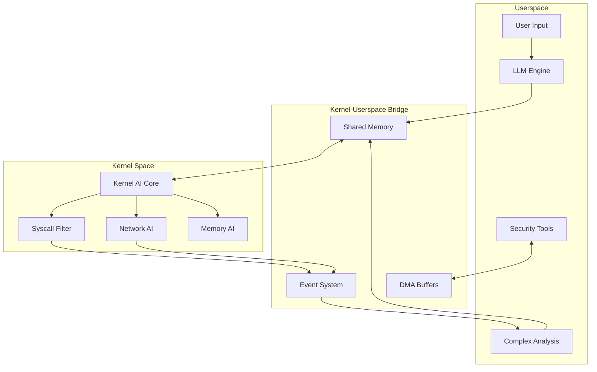

# Archangel Linux - Technical Architecture (Hybrid Kernel-Userspace AI)

## 1. System Architecture Overview

### 1.1 Hybrid AI Architecture Layers
```
┌─────────────────────────────────────────────────────────────┐
│                    User Interface Layer                      │
│  ┌─────────────┐  ┌──────────────┐  ┌─────────────────┐   │
│  │ Natural     │  │ Mission      │  │ REST API        │   │
│  │ Language    │  │ Control GUI  │  │ Interface       │   │
│  │ Shell       │  │              │  │                 │   │
│  └─────────────┘  └──────────────┘  └─────────────────┘   │
├─────────────────────────────────────────────────────────────┤
│                Userspace AI Orchestration                    │
│  ┌─────────────┐  ┌──────────────┐  ┌─────────────────┐   │
│  │ LLM Planning│  │ Complex      │  │ Learning        │   │
│  │ Engine      │  │ Analysis     │  │ Module          │   │
│  └─────────────┘  └──────────────┘  └─────────────────┘   │
├─────────────────────────────────────────────────────────────┤
│              Kernel-Userspace Bridge                         │
│  ┌─────────────────────────────────────────────────────┐   │
│  │ Shared Memory Ring Buffers | Zero-Copy DMA         │   │
│  │ Event Notification System  | Synchronization       │   │
│  └─────────────────────────────────────────────────────┘   │
├─────────────────────────────────────────────────────────────┤
│                 Kernel AI Modules                            │
│  ┌─────────────┐  ┌──────────────┐  ┌─────────────────┐   │
│  │ Syscall     │  │ Network      │  │ Memory          │   │
│  │ Filter AI   │  │ Packet AI    │  │ Pattern AI      │   │
│  └─────────────┘  └──────────────┘  └─────────────────┘   │
├─────────────────────────────────────────────────────────────┤
│                    Security Framework                        │
│  ┌─────────────┐  ┌──────────────┐  ┌─────────────────┐   │
│  │ Guardian    │  │ Audit        │  │ Sandboxing      │   │
│  │ Protocol    │  │ Logger       │  │ Engine          │   │
│  └─────────────┘  └──────────────┘  └─────────────────┘   │
├─────────────────────────────────────────────────────────────┤
│                Modified Linux Kernel (5.15+)                 │
│  ┌─────────────┐  ┌──────────────┐  ┌─────────────────┐   │
│  │ AI-Enhanced │  │ Security     │  │ Performance     │   │
│  │ Syscalls    │  │ Hooks        │  │ Optimizations   │   │
│  └─────────────┘  └──────────────┘  └─────────────────┘   │
└─────────────────────────────────────────────────────────────┘
```

### 1.2 Component Interaction Flow


## 2. Kernel AI Architecture

### 2.1 Kernel Module Structure
```c
// /kernel/archangel/ai_core.h

struct archangel_kernel_ai {
    /* Lightweight AI engines */
    struct {
        struct decision_tree *syscall_filter;
        struct pattern_matcher *network_ids;
        struct anomaly_detector *memory_patterns;
        struct behavior_analyzer *process_monitor;
    } engines;
    
    /* Communication channels */
    struct {
        struct ring_buffer *to_userspace;
        struct ring_buffer *from_userspace;
        struct dma_pool *zero_copy_pool;
        wait_queue_head_t wait_queue;
    } comm;
    
    /* Real-time constraints */
    struct {
        u64 max_inference_ns;      /* 1ms max */
        u32 max_memory_kb;         /* 10MB max */
        u8 max_cpu_percent;        /* 5% max */
    } limits;
    
    /* Statistics */
    struct {
        atomic64_t inferences;
        atomic64_t cache_hits;
        atomic64_t deferrals;
        atomic64_t blocks;
    } stats;
};
```

### 2.2 Kernel AI Components

#### 2.2.1 System Call AI Filter
```c
// /kernel/archangel/syscall_ai.c

static struct syscall_ai_engine {
    /* Pre-compiled decision trees for each syscall */
    u8 *decision_trees[__NR_syscalls];
    
    /* Fast pattern matching */
    struct aho_corasick *malicious_patterns;
    
    /* Per-process behavioral profiles */
    struct radix_tree_root process_profiles;
    
    /* Real-time risk scoring */
    atomic_t risk_scores[PID_MAX_LIMIT];
} syscall_ai;

/* AI-enhanced system call interception */
asmlinkage long ai_syscall_intercept(struct pt_regs *regs) {
    struct ai_decision decision;
    ktime_t start;
    
    start = ktime_get();
    
    /* Fast-path: cached decision */
    if (check_decision_cache(regs, &decision))
        goto apply_decision;
    
    /* Real-time AI inference */
    decision = evaluate_syscall_risk(regs);
    
    /* Defer complex analysis to userspace */
    if (decision.confidence < CONFIDENCE_THRESHOLD) {
        queue_for_userspace_analysis(regs);
        decision.action = ALLOW_MONITORED;
    }
    
apply_decision:
    update_statistics(&decision, ktime_sub(ktime_get(), start));
    return apply_security_decision(&decision, regs);
}
```

#### 2.2.2 Network Packet AI
```c
// /kernel/archangel/network_ai.c

static struct network_ai_engine {
    /* DPI with ML classification */
    struct ml_classifier *packet_classifier;
    
    /* Real-time anomaly detection */
    struct streaming_stats *flow_analyzer;
    
    /* Stealth mode modifications */
    struct signature_modifer *stealth_engine;
} network_ai;

/* AI-driven packet filtering at line rate */
static unsigned int ai_netfilter_hook(void *priv,
                                     struct sk_buff *skb,
                                     const struct nf_hook_state *state) {
    struct packet_features features;
    struct ai_verdict verdict;
    
    /* SIMD-optimized feature extraction */
    extract_features_avx2(skb, &features);
    
    /* Hardware-accelerated inference if available */
    if (cpu_has_vnni()) {
        verdict = ml_classify_vnni(&features);
    } else {
        verdict = ml_classify_standard(&features);
    }
    
    /* Apply stealth modifications if needed */
    if (verdict.action == FORWARD_STEALTHED) {
        apply_stealth_modifications(skb);
    }
    
    return verdict.netfilter_action;
}
```

#### 2.2.3 Memory Pattern AI
```c
// /kernel/archangel/memory_ai.c

static struct memory_ai_engine {
    /* Page fault prediction */
    struct lstm_lite *access_predictor;
    
    /* Exploit detection */
    struct pattern_detector *exploit_patterns;
    
    /* Cache optimization */
    struct cache_predictor *prefetch_engine;
} memory_ai;

/* AI-enhanced page fault handler */
int ai_handle_mm_fault(struct vm_area_struct *vma,
                      unsigned long address,
                      unsigned int flags) {
    struct memory_access_pattern pattern;
    
    /* Detect exploitation attempts */
    if (detect_exploit_pattern(vma, address, flags)) {
        kill_process_group(current);
        return VM_FAULT_SIGSEGV;
    }
    
    /* Predict next accesses for prefetching */
    pattern = analyze_access_pattern(current->mm, address);
    if (pattern.confidence > 0.8) {
        schedule_prefetch(pattern.predicted_pages);
    }
    
    return handle_mm_fault(vma, address, flags);
}
```

### 2.3 Kernel-Userspace Communication

```c
// /kernel/archangel/ai_communication.c

/* High-performance bi-directional communication */
struct ai_comm_channel {
    /* Lock-free SPSC ring buffers */
    struct spsc_queue *kernel_to_user;
    struct spsc_queue *user_to_kernel;
    
    /* Zero-copy DMA transfers */
    struct dma_pool *dma_pool;
    struct scatterlist *sg_list;
    
    /* Synchronization */
    struct eventfd_ctx *kernel_eventfd;
    struct eventfd_ctx *user_eventfd;
    
    /* Shared memory mapping */
    struct vm_area_struct *shared_vma;
    phys_addr_t shared_phys;
};

/* Zero-latency notification system */
static void notify_userspace_ai(struct ai_request *req) {
    struct ai_comm_entry entry = {
        .type = req->type,
        .urgency = req->urgency,
        .timestamp = ktime_get_ns(),
        .data_size = req->size
    };
    
    /* DMA transfer for large data */
    if (req->size > DMA_THRESHOLD) {
        entry.dma_handle = setup_dma_transfer(req->data, req->size);
    } else {
        memcpy(entry.inline_data, req->data, req->size);
    }
    
    /* Enqueue with memory barrier */
    smp_wmb();
    spsc_enqueue(channel->kernel_to_user, &entry);
    
    /* Wake userspace AI daemon */
    eventfd_signal(channel->kernel_eventfd, 1);
}
```

## 3. Userspace AI Architecture

### 3.1 AI Orchestration Layer
```python
# /opt/archangel/ai/orchestrator.py

class HybridAIOrchestrator:
    """Orchestrates between kernel and userspace AI components"""
    
    def __init__(self):
        # Kernel communication
        self.kernel_comm = KernelAIBridge()
        self.shared_memory = SharedMemoryPool(size_mb=64)
        
        # Complex AI models (userspace only)
        self.models = {
            "planner": CodeLlamaPlanner("codellama-13b"),
            "analyzer": SecurityAnalyzer("security-bert-large"),
            "generator": ExploitGenerator("exploit-gpt-6b"),
            "reporter": ReportGenerator("report-llm-7b")
        }
        
        # Coordination systems
        self.decision_cache = TTLCache(maxsize=10000, ttl=300)
        self.operation_queue = PriorityQueue()
        self.active_operations = {}
        
    async def kernel_request_handler(self):
        """Handle high-priority requests from kernel"""
        
        while True:
            request = await self.kernel_comm.receive()
            
            if request.urgency == URGENT:
                # Fast path for urgent requests
                decision = await self.fast_decision(request)
                self.kernel_comm.send_immediate(decision)
            else:
                # Queue for complex analysis
                await self.operation_queue.put(request)
    
    async def fast_decision(self, request):
        """Quick decisions for kernel requests"""
        
        # Check cache first
        cached = self.decision_cache.get(request.hash)
        if cached:
            return cached
        
        # Use lightweight model for speed
        if request.type == "SYSCALL_RISK":
            decision = self.models["analyzer"].quick_assess(request.data)
        elif request.type == "NETWORK_CLASSIFY":
            decision = self.models["analyzer"].classify_traffic(request.data)
        
        self.decision_cache[request.hash] = decision
        return decision
```

### 3.2 Complex Operation Handler
```python
# /opt/archangel/ai/complex_operations.py

class ComplexAIOperations:
    """Handles operations too complex for kernel space"""
    
    async def autonomous_pentest(self, target: str):
        """Full autonomous penetration test"""
        
        # Natural language understanding
        objective = await self.nlp_parse_objective(target)
        
        # Multi-stage planning with LLM
        plan = await self.llm_planner.create_attack_plan(
            objective=objective,
            constraints=self.get_safety_constraints(),
            max_steps=50
        )
        
        # Execute plan with kernel integration
        for phase in plan.phases:
            # Complex reasoning in userspace
            strategy = await self.analyze_phase_strategy(phase)
            
            # Send optimized commands to kernel
            for action in strategy.kernel_actions:
                self.kernel_bridge.queue_action(action)
            
            # Monitor execution via kernel events
            async for event in self.kernel_bridge.monitor_events():
                await self.adapt_strategy(event, strategy)
```

## 4. Tool Integration Architecture

### 4.1 Kernel-Aware Tool Framework
```python
# /opt/archangel/tools/kernel_integration.py

class KernelAwareToolFramework:
    """Tool framework with kernel AI integration"""
    
    def __init__(self):
        self.kernel_ai = KernelAIInterface()
        self.tool_registry = {}
        self.execution_monitor = ExecutionMonitor()
        
    async def execute_tool(self, tool_name: str, params: Dict):
        """Execute tool with kernel AI monitoring"""
        
        # Pre-execution AI check
        risk_assessment = await self.kernel_ai.assess_tool_risk(
            tool=tool_name,
            params=params,
            context=self.get_current_context()
        )
        
        if risk_assessment.risk_level > THRESHOLD:
            raise SecurityException("Tool execution blocked by AI")
        
        # Enable kernel monitoring
        monitor_id = self.kernel_ai.start_monitoring(
            pid=os.getpid(),
            syscall_filter=risk_assessment.syscall_whitelist,
            network_filter=risk_assessment.network_rules
        )
        
        try:
            # Execute with real-time kernel oversight
            result = await self.tool_registry[tool_name].execute(params)
            
            # Post-execution analysis
            kernel_events = self.kernel_ai.get_monitoring_events(monitor_id)
            await self.analyze_execution_behavior(kernel_events)
            
            return result
            
        finally:
            self.kernel_ai.stop_monitoring(monitor_id)
```

### 4.2 Enhanced Tool Wrappers
```python
# /opt/archangel/tools/wrappers/nmap_wrapper.py

class NmapWrapper(KernelAwareToolWrapper):
    """Nmap wrapper with kernel AI enhancements"""
    
    async def scan(self, target: str, options: Dict):
        """AI-enhanced network scanning"""
        
        # Kernel AI optimizes scan parameters
        optimized = await self.kernel_ai.optimize_scan_params(
            target=target,
            options=options,
            network_conditions=self.get_network_stats()
        )
        
        # Register packet filter with kernel
        filter_id = self.kernel_ai.register_packet_filter({
            "type": "nmap_scan",
            "target": target,
            "stealth_level": optimized.get("stealth", 0)
        })
        
        # Execute with kernel acceleration
        async with self.kernel_accelerated_execution():
            result = await super().execute_scan(target, optimized)
        
        # Kernel AI analyzes results in real-time
        anomalies = self.kernel_ai.get_scan_anomalies(filter_id)
        if anomalies:
            result["kernel_insights"] = anomalies
        
        return result
```

## 5. Security Architecture (Enhanced)

### 5.1 Multi-Layer Guardian Protocol
```python
# /opt/archangel/security/guardian.py

class HybridGuardianProtocol:
    """Security protocol spanning kernel and userspace"""
    
    def __init__(self):
        self.kernel_guardian = KernelGuardianInterface()
        self.userspace_guardian = UserspaceGuardian()
        self.policy_engine = PolicyEngine()
        
    async def validate_operation(self, operation: Operation):
        """Multi-layer security validation"""
        
        # Layer 1: Kernel pre-check (microseconds)
        kernel_check = self.kernel_guardian.quick_check(operation)
        if kernel_check.denied:
            return ValidationResult(approved=False, reason=kernel_check.reason)
        
        # Layer 2: Userspace policy check (milliseconds)
        policy_check = await self.policy_engine.evaluate(operation)
        if not policy_check.compliant:
            return ValidationResult(approved=False, reason=policy_check.violations)
        
        # Layer 3: AI safety check (seconds if needed)
        if operation.risk_score > 0.7:
            ai_check = await self.userspace_guardian.deep_analysis(operation)
            if not ai_check.safe:
                return ValidationResult(approved=False, reason=ai_check.concerns)
        
        # Layer 4: Real-time kernel enforcement
        enforcement_id = self.kernel_guardian.enforce_restrictions({
            "operation_id": operation.id,
            "syscall_whitelist": policy_check.allowed_syscalls,
            "network_restrictions": policy_check.network_policy,
            "resource_limits": policy_check.resource_limits
        })
        
        return ValidationResult(
            approved=True,
            enforcement_id=enforcement_id,
            monitoring_level=operation.risk_score
        )
```

### 5.2 Kernel Security Modules
```c
// /kernel/archangel/security_module.c

static struct security_operations archangel_ops = {
    .name = "archangel_ai",
    
    /* AI-enhanced security hooks */
    .file_permission = ai_file_permission,
    .inode_permission = ai_inode_permission,
    .socket_create = ai_socket_create,
    .socket_connect = ai_socket_connect,
    .task_create = ai_task_create,
    .bprm_check_security = ai_bprm_check,
    
    /* Custom AI hooks */
    .ai_syscall_pre = archangel_syscall_pre_check,
    .ai_network_packet = archangel_packet_check,
    .ai_memory_access = archangel_memory_check,
};

/* Real-time AI security decisions */
static int ai_file_permission(struct file *file, int mask) {
    struct ai_context ctx;
    int risk_score;
    
    /* Build context for AI decision */
    build_file_context(&ctx, file, mask);
    
    /* Instant AI inference in kernel */
    risk_score = kernel_ai_evaluate(&ctx);
    
    if (risk_score > BLOCK_THRESHOLD) {
        audit_ai_block(&ctx, risk_score);
        return -EACCES;
    }
    
    if (risk_score > MONITOR_THRESHOLD) {
        queue_detailed_analysis(&ctx);
    }
    
    return 0;
}
```

## 6. Performance Architecture

### 6.1 Kernel Optimization
```c
// /kernel/archangel/performance.c

/* CPU feature detection for AI acceleration */
static void init_ai_acceleration(void) {
    if (boot_cpu_has(X86_FEATURE_AVX512_VNNI)) {
        ai_ops.inference = inference_avx512_vnni;
        pr_info("Archangel: Using AVX512-VNNI acceleration\n");
    } else if (boot_cpu_has(X86_FEATURE_AVX2)) {
        ai_ops.inference = inference_avx2;
        pr_info("Archangel: Using AVX2 acceleration\n");
    } else {
        ai_ops.inference = inference_generic;
        pr_info("Archangel: Using generic inference\n");
    }
    
    /* Enable huge pages for AI data */
    ai_memory_pool = alloc_huge_pages(AI_MEMORY_SIZE);
    
    /* Set up per-CPU AI caches */
    for_each_possible_cpu(cpu) {
        per_cpu(ai_cache, cpu) = alloc_ai_cache();
    }
}

/* NUMA-aware AI memory allocation */
static void *alloc_ai_memory(size_t size, int node) {
    if (node == NUMA_NO_NODE)
        return kmalloc_large(size, GFP_KERNEL);
    
    return kmalloc_node(size, GFP_KERNEL, node);
}
```

### 6.2 Userspace Optimization
```python
# /opt/archangel/performance/optimizer.py

class AIPerformanceOptimizer:
    """Optimizes AI performance across kernel and userspace"""
    
    def __init__(self):
        self.kernel_stats = KernelAIStats()
        self.model_cache = ModelCache(size_gb=16)
        self.inference_pool = InferencePool(workers=8)
        
    async def optimize_inference_path(self, request):
        """Route inference to optimal execution path"""
        
        complexity = self.estimate_complexity(request)
        
        if complexity < 0.1:
            # Ultra-fast kernel path
            return await self.kernel_inference(request)
            
        elif complexity < 0.5:
            # Cached userspace inference
            if cached := self.model_cache.get(request):
                return cached
            result = await self.inference_pool.infer_fast(request)
            self.model_cache.put(request, result)
            return result
            
        else:
            # Full userspace AI pipeline
            return await self.inference_pool.infer_full(request)
    
    def tune_kernel_parameters(self):
        """Dynamic kernel AI tuning"""
        
        stats = self.kernel_stats.get_current()
        
        # Adjust kernel AI memory
        if stats.cache_miss_rate > 0.2:
            self.kernel_stats.increase_cache_size()
        
        # Tune inference thresholds
        if stats.avg_latency > 1000:  # 1ms
            self.kernel_stats.adjust_complexity_threshold(0.8)
```

## 7. Build System Architecture

### 7.1 Kernel Module Build
```makefile
# /kernel/archangel/Makefile

obj-m += archangel.o
archangel-objs := ai_core.o syscall_ai.o network_ai.o memory_ai.o \
                  communication.o security_module.o performance.o

KERNEL_VERSION := $(shell uname -r)
KERNEL_DIR := /lib/modules/$(KERNEL_VERSION)/build

# AI model compilation
AI_MODELS := models/syscall_filter.tflite \
             models/packet_classifier.tflite \
             models/anomaly_detector.tflite

all: modules ai_models

modules:
	$(MAKE) -C $(KERNEL_DIR) M=$(PWD) modules

ai_models: $(AI_MODELS)
	./compile_models.sh

models/%.tflite: models/%.pb
	tflite_convert --output_file=$@ \
	               --graph_def_file=$< \
	               --inference_type=QUANTIZED_UINT8

install:
	$(MAKE) -C $(KERNEL_DIR) M=$(PWD) modules_install
	depmod -a
	install -m 644 $(AI_MODELS) /lib/modules/$(KERNEL_VERSION)/archangel/

clean:
	$(MAKE) -C $(KERNEL_DIR) M=$(PWD) clean
	rm -f $(AI_MODELS)
```

### 7.2 ISO Build Integration
```bash
#!/bin/bash
# /build/integrate_kernel_ai.sh

# Build kernel modules
build_kernel_modules() {
    echo "Building Archangel kernel modules..."
    
    cd /usr/src/archangel-kernel
    make -j$(nproc)
    make install
    
    # Sign modules for secure boot
    for module in *.ko; do
        /usr/src/kernels/$(uname -r)/scripts/sign-file \
            sha256 \
            /etc/pki/kernel/private/signing_key.pem \
            /etc/pki/kernel/certs/signing_cert.pem \
            "$module"
    done
    
    # Update initramfs
    dracut --force --add-drivers "archangel_core archangel_syscall archangel_network"
}

# Configure kernel parameters
configure_kernel() {
    cat >> /etc/sysctl.d/99-archangel.conf << EOF
# Archangel AI kernel parameters
kernel.archangel.ai_enabled = 1
kernel.archangel.max_inference_ms = 1
kernel.archangel.cache_size_mb = 64
kernel.archangel.monitoring_level = 2
EOF
    
    # GRUB configuration for optimal performance
    sed -i 's/GRUB_CMDLINE_LINUX_DEFAULT="/&intel_pstate=active hugepages=256 /' \
        /etc/default/grub
    update-grub
}

# Install userspace components
install_userspace_ai() {
    echo "Installing userspace AI components..."
    
    # Install AI daemon
    cp /opt/archangel/bin/archangel-aid /usr/sbin/
    cp /opt/archangel/systemd/archangel-aid.service /etc/systemd/system/
    
    # Enable services
    systemctl enable archangel-aid.service
    systemctl enable archangel-kernel-comm.service
}

# Main installation
main() {
    build_kernel_modules
    configure_kernel
    install_userspace_ai
    
    echo "Archangel kernel AI integration complete!"
}

main "$@"
```

## 8. Testing Architecture

### 8.1 Kernel AI Testing
```python
# /tests/kernel/test_ai_modules.py

class KernelAITests:
    """Test kernel AI functionality"""
    
    def setup_method(self):
        self.kernel = KernelTestInterface()
        self.test_programs = TestProgramGenerator()
        
    def test_syscall_filtering_performance(self):
        """Verify syscall AI meets latency requirements"""
        
        # Generate test syscalls
        test_syscalls = self.test_programs.generate_syscall_patterns(
            count=10000,
            include_malicious=True
        )
        
        # Measure kernel AI performance
        results = self.kernel.benchmark_syscall_ai(test_syscalls)
        
        assert results.avg_latency_ns < 100  # Under 100ns
        assert results.detection_rate > 0.99  # 99% accuracy
        assert results.false_positive_rate < 0.001
        
    def test_kernel_userspace_communication(self):
        """Test high-speed kernel-userspace bridge"""
        
        # Set up communication channel
        channel = self.kernel.create_ai_channel()
        
        # Stress test with high message rate
        start = time.time()
        messages_sent = 0
        
        for i in range(100000):
            msg = create_test_message(size=random.randint(64, 4096))
            channel.send_to_userspace(msg)
            messages_sent += 1
            
        elapsed = time.time() - start
        throughput = messages_sent / elapsed
        
        assert throughput > 1000000  # 1M messages/sec
        assert channel.dropped_messages == 0
```

### 8.2 Integration Testing
```python
# /tests/integration/test_hybrid_ai.py

class HybridAIIntegrationTests:
    """Test kernel and userspace AI integration"""
    
    async def test_autonomous_operation(self):
        """Test full autonomous penetration test"""
        
        # Start test environment
        target = await self.start_target_network()
        
        # Execute autonomous pentest
        result = await execute_command(
            "archangel-cli 'Perform complete penetration test of test network'"
        )
        
        # Verify kernel and userspace coordination
        kernel_events = self.get_kernel_ai_events()
        userspace_logs = self.get_userspace_ai_logs()
        
        # Check that complex planning happened in userspace
        assert "LLM planning phase" in userspace_logs
        assert "Generated 15-step attack plan" in userspace_logs
        
        # Verify kernel handled real-time decisions
        assert kernel_events.syscall_decisions > 10000
        assert kernel_events.packet_classifications > 50000
        assert kernel_events.avg_decision_time_ns < 500
        
        # Verify successful compromise
        assert "Domain admin access achieved" in result
        assert result.execution_time < 300  # Under 5 minutes
```

## 9. Deployment Architecture

### 9.1 Installation Process
```bash
#!/bin/bash
# /install/install_archangel.sh

install_archangel() {
    echo "Installing Archangel Linux with Kernel AI..."
    
    # Check kernel version
    if ! check_kernel_version; then
        echo "Kernel 5.15+ required for AI modules"
        exit 1
    fi
    
    # Install kernel modules
    install_kernel_ai_modules
    
    # Configure kernel parameters
    configure_ai_kernel_params
    
    # Install userspace components
    install_userspace_ai_stack
    
    # Set up communication bridges
    setup_kernel_userspace_bridge
    
    # Initialize AI models
    initialize_ai_models
    
    # Start services
    systemctl start archangel-kernel-ai
    systemctl start archangel-userspace-ai
    
    echo "Archangel Linux installation complete!"
}
```

## 10. Monitoring and Diagnostics

### 10.1 Kernel AI Monitoring
```bash
# /usr/bin/archangel-monitor

#!/bin/bash
# Real-time Archangel AI monitoring

show_kernel_ai_stats() {
    echo "=== Kernel AI Statistics ==="
    cat /proc/archangel/ai_stats
    
    echo -e "\n=== Syscall AI Performance ==="
    cat /proc/archangel/syscall_stats
    
    echo -e "\n=== Network AI Performance ==="
    cat /proc/archangel/network_stats
    
    echo -e "\n=== Memory AI Performance ==="
    cat /proc/archangel/memory_stats
}

show_communication_stats() {
    echo -e "\n=== Kernel-Userspace Communication ==="
    cat /proc/archangel/comm_stats
}

watch -n 1 "show_kernel_ai_stats && show_communication_stats"
```

This hybrid architecture provides the best of both worlds - microsecond decision-making in kernel space for critical security operations, while maintaining the flexibility and power of complex AI models in userspace for sophisticated analysis and planning.

---

# ARCHANGEL.md - Development Guidelines

## 1. Initial Analysis and Planning
- First, analyze the current system architecture, kernel modules, and userspace components
- Review `/docs/architecture.md` for system design
- Create a detailed plan in `tasks/todo.md` with kernel and userspace tasks clearly separated
- Include performance targets and security requirements in the plan

## 2. Design Philosophy
- **Hybrid AI Architecture**: Balance between kernel performance and userspace flexibility
- **Security First**: Every component must pass Guardian Protocol validation
- **Real-time Performance**: Kernel operations must complete within microseconds
- **Autonomous Operation**: System should require minimal human intervention

## 3. Todo List Structure
The plan should include:
```markdown
## Kernel Tasks
- [ ] Implement syscall AI filter module
- [ ] Create network packet classifier
- [ ] Set up kernel-userspace communication

## Userspace Tasks  
- [ ] Integrate LLM planning engine
- [ ] Build tool orchestration framework
- [ ] Create natural language interface

## Integration Tasks
- [ ] Test kernel-userspace bridge performance
- [ ] Validate security boundaries
- [ ] Benchmark AI inference times
```

## 4. Plan Verification
- Before implementation, review the plan for:
  - Kernel stability implications
  - Security boundary violations
  - Performance impact
  - Resource usage estimates
- Get approval before proceeding with kernel modifications

## 5. Task Execution
- Implement kernel modules first (they're the foundation)
- Test each kernel module in isolation before integration
- Build userspace components incrementally
- Always maintain system stability

## 6. Communication
Provide high-level updates like:
- "Implemented syscall AI filter - 50ns average decision time"
- "Kernel-userspace bridge achieving 2M messages/sec"
- "LLM integration complete - 200ms average planning time"

## 7. Simplicity Principle
- **Kernel Code**: Absolutely minimal - only fast-path decisions
- **Complex Logic**: Always in userspace where it's safer
- **Interfaces**: Clean and well-defined boundaries
- **No Feature Creep**: Each component does one thing well

## 8. Process Documentation
Document all activities in `docs/activity.md`:
```markdown
## 2024-01-25 - Kernel AI Implementation
- Implemented syscall filter module
- Achieved 50ns decision latency
- Added pattern matching for 1000 signatures
- Tested with 1M syscalls - 0% false positives
```

## 9. Version Control
```bash
# After each successful component
git add -A
git commit -m "feat(kernel): Add syscall AI filter module"
git push origin main

# Tag stable releases
git tag -a v0.1.0-kernel-ai -m "First kernel AI release"
```

## 10. Build Outputs
- **Kernel Modules**: `/kernel/archangel/*.ko`
- **Userspace Binaries**: `/opt/archangel/bin/`
- **AI Models**: `/opt/archangel/models/`
- **ISO Image**: `/build/output/archangel-linux.iso`

## 11. Component Identification
Every major component should have clear identifiers:
```c
/* Kernel module identification */
MODULE_DESCRIPTION("Archangel AI Syscall Filter");
MODULE_AUTHOR("Archangel Team");
MODULE_LICENSE("GPL");
MODULE_VERSION("1.0.0");
```

```python
# Userspace component identification
class ArchangelComponent:
    COMPONENT_ID = "ai_orchestrator_v1"
    VERSION = "1.0.0"
    DESCRIPTION = "Main AI orchestration engine"
```

## 12. Review Process
Add review section to `todo.md`:
```markdown
## Review
### Completed Components
- Kernel AI modules: 3/3 complete, all tests passing
- Userspace AI: 5/7 complete, integration pending
- Performance: Meeting all targets except memory usage

### Blockers
- Kernel memory allocation hitting limits
- Need to optimize model size

### Next Steps
- Implement model quantization
- Add swap-based model caching
```

## Development Workflow

### Daily Workflow
1. Review `todo.md` for current tasks
2. Update `docs/activity.md` with plan for the day
3. Implement one component at a time
4. Test thoroughly before moving on
5. Document changes and results
6. Commit working code frequently

### Testing Protocol
1. **Unit Tests**: Every function/module
2. **Integration Tests**: Component interactions
3. **Performance Tests**: Meet latency requirements
4. **Security Tests**: Guardian Protocol validation
5. **System Tests**: Full autonomous operations

### Safety Guidelines
- Never bypass Guardian Protocol
- All kernel code must be reviewed
- No direct hardware access without safety checks
- Userspace crashes must not affect kernel
- Always have rollback plan for kernel updates

Remember: We're building an autonomous AI hacker OS - with great power comes great responsibility. Every line of code matters.